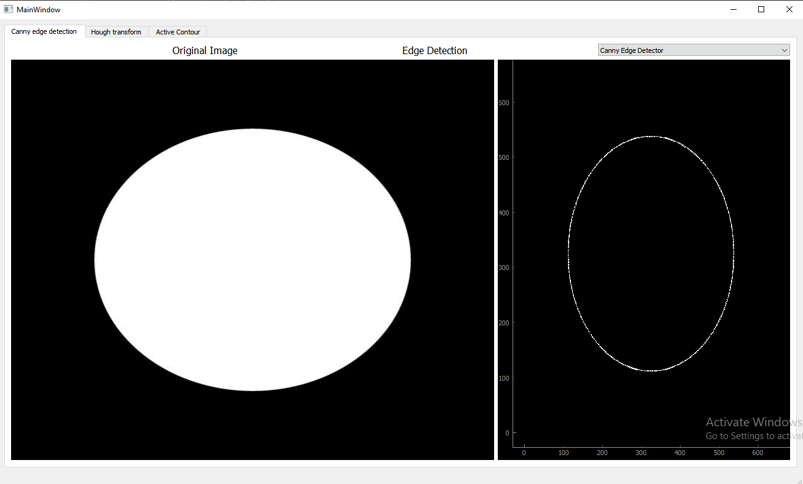

# Task 2

## Canny Edge Detection

Canny's Edge Detector is well known for its ability to generate single-pixel thick continuous edges.

### Step 1: Generation of Masks:

This module requires the value of sigma as an input and generates x- and y-derivative masks as output. In Canny's method, the masks used are 1st derivative of a Gaussian in x- and y-directions. 
To generate the masks, the first step is a  computation of the mask size. The mask size should not be too large compared to the lobes of the mask, otherwise it will result in unnecessary computational overhead during convolution. At the same time, the mask size should not be so small to loose the characteristics of primary lobes. We chose mask size based on analysing the Gaussian and applying a threshold T. 
First, size of half mask, sHalf is computed by finding the point on the curve where the Gaussian value drops below T, i.e. solving exp(-x^2/(2*sigma^2) = T. This gives sHalf = round(sqrt(-log(T) * 2 * sigma^2)). The mask size is then 2*sHalf + 1 to incorporate both positive and negative sides of the mask. We also put a lower limit on sigma of 0.5, because below that the mask size came out to be less than 3, which was not reasonable for finding fx and fy.
Once the masks are generated, they are scaled and rounded off so that convolution is done with integer values rather than floats. The scale factor is saved, because gradient magnitude is later scaled down (after convolution) by the same factor.

### Step 2: Applying Masks to Images

The masks are applied to the images using convolution. The result is then scaled down by the same factor which was used to scale up the masks. To write output to image files, the min and max values are scaled to 0 and 255 respectively. 

The effect of increasing sigma is obvious from the convolved images: the gradients are much smoother. It should be noted that horizontally running edges are identified in fx, because the gradient change occurs when moving along the x (downward) direction. Simlarly vertical edges are seen in fy.

### Step 3: Non Maxima Suppression:

Non maxima supression step makes all edges in M one pixel thick. This is an important step in Canny's algorithm, which distinguishes it from other algorithms. The first step is to quantize gradient direction into just four directions.
The next step is to pick two neighbors of each edge point along the gradient direction. This is because gradient direction is perpendicular to the edge, and therefore, this is the direction in which we are searching for edge points. For example, for quantized direction 0, the gradient direction could be less than 0 degrees, meaning the edge is a horizontal edge. Therefore the two neighbors that need to be picked for comparison are the north and south neighbors, denoted in code by (r-1, c) and (r+1,c) respectively. If the edge point (r,c) is greater than both these neighbors, then it is maintained in M otherwise it is made zero.

### Step 4: Hysteresis Thresholding

The final step in Canny's edge detection algorithm is to apply two thresholds to follow edges. Since edges are to be followed recursively by looking at neighbors, we first made the border pixels zero, so that finding neighbors does not go out of bounds of the image. Next, the image is scanned from left to right, top to bottom. The first pixel in non-maxima suppressed magnitude image which is above a certain threshold, Th, is declared an edge. Then all its neighbors are recursively followed, and those above threshold, Tl, are marked as an edge. A visited map is also maintained so that recursion does not loop infinitely. Thus there are really two stopping conditions: if a neighbor is below Tl, we wont recurse on it; also, if a neighbor has already been visited, then we won't recurse on it.

## Result:

## Active contour 

An active contour model, also called a snake is technique for detecting and segmenting objects using deformable curves which will match the objects. It relies on a deformable model controlled by an energy minimization function. This energy depends on the image and also on the parameter we want to give to our deformable contour.

### Active Contour Model

1. #### Gaussian Smoothing

   An important part of the set up to perform a segmentation using active contour is to preprocess the image using a Gaussian filtering. If our input image has a good quality, its edges are going to be extremely well defined, which means that there are going to be abrupt. This is going to be bad for our optimization algorithm and the snake energy evolution because the external energy relies on the use of the image gradient. If our input image has a good quality, its edges are going to be extremely well defined, which means that there are going to be abrupt. This is going to be bad for our optimization algorithm and the snake energy evolution because the external energy relies on the use of the image gradient.

2. #### Contour Construction 

   We draw the big circle around object in the image. Then, the size of the circle decreases until get the edges of the object and the shape of the circle changes around to the object.

3. #### Greedy Method

   The greedy method is an implementation technique used to simplify the implementation of the minimization of energy without having to perform an optimization algorithm technique such as the gradient descent. It works under the assumption that finding for each point of the contour the closest local energy minimizing neighbor will converge to the overall global minimum of the contour. 

   In greedy method, we should select the number of iterations to steps, which is large number or Making the loop stops when the contour get the right edges of object. we are using the second solution. 
   
   

### Results of Active contour

The first test to see if our implementation was working was to analyze the evolution of the contour. In this implementation, we had to see each point being displaced over time in the way we selected them because we are iterating over points to make them move. the set-up of the α, β and gamma coefficient does play an important role in the shape of the contour. 

After testing in previous image examples, we have to test the implementation on the images like in the lecture. When we test the algorithm, we get the good results like:

#### How the function work in GUI:

when you open the tab of active contour, you found two button "Start" & "Clear".  when you press start button, we get the image and circle around the image and this circle decreases until getting the edges of object. To stop this operation, in any time you should press "clear" button which make the circle to stop decreasing. before closing the app,you should press "clear" button to stop the operation and remove the image. 

### Computing Area and perimeter: 

#### perimeter:

A perimeter is either a path that encompasses/surrounds/outlines a shape in two dimensions or its length one-dimensional. The perimeter of a circle or an ellipse is called its circumference.

Calculating the perimeter has several practical applications. A calculated perimeter is the length of fence required to surround a yard or garden. The perimeter of a wheel/circle (its circumference) describes how far it will roll in one revolution. Similarly, the amount of string wound around a spool is related to the spool's perimeter; if the length of the string was exact, it would equal the perimeter.

Area:

The Area is calculated from the shapes contour (periphery), i.e. the closed polygon that surrounds the feature. The area is calculated using:

In the GUI, we calculate the perimeter and area as follow:

